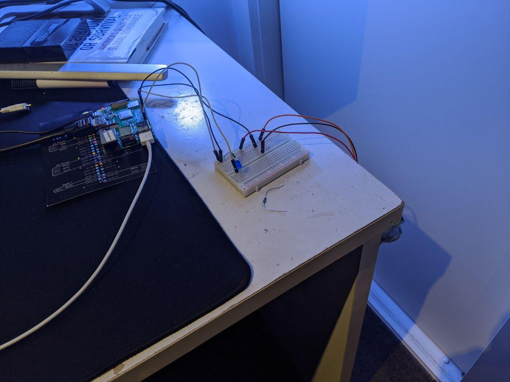
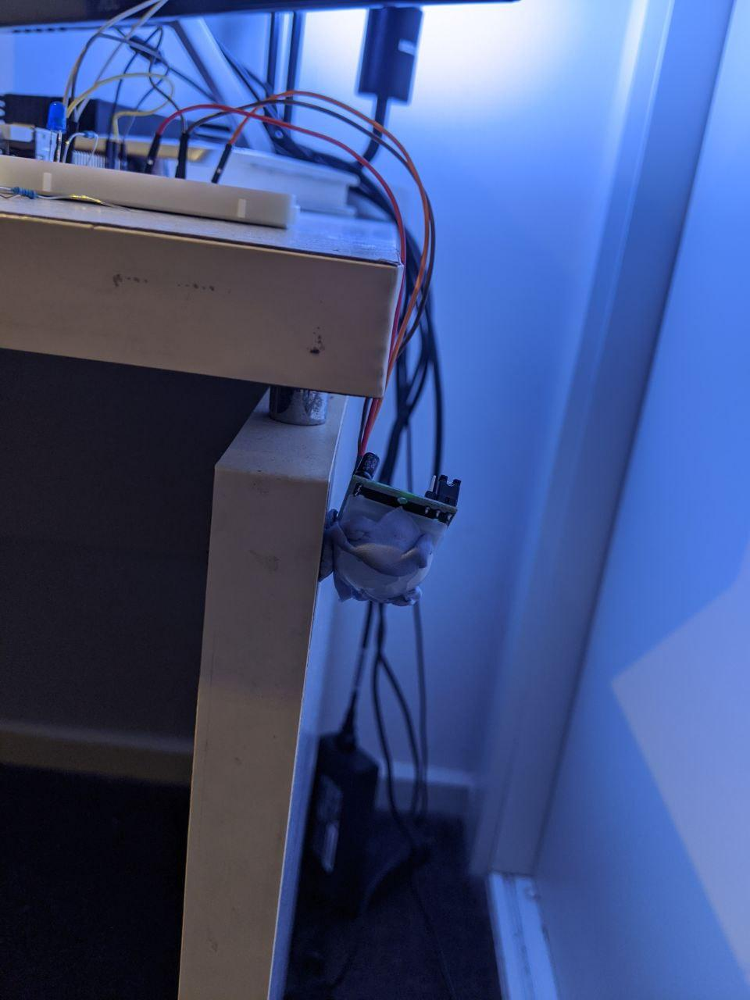
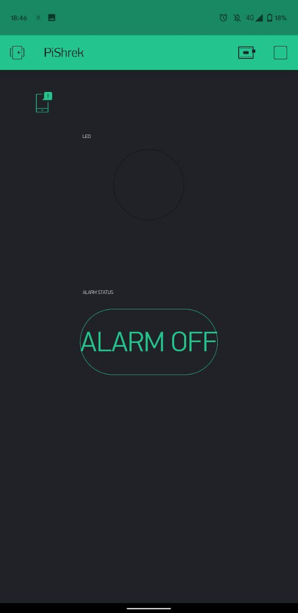
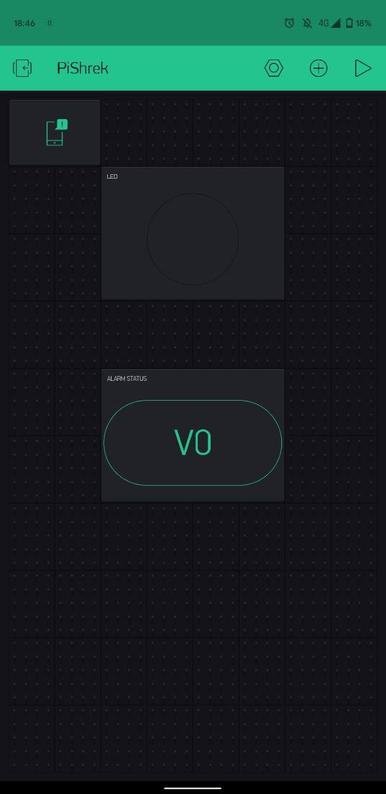

# Shrek Alarm
The safest security system ever created. When intruders will make any movement inside your house, Shrek will be ready to welcome them!

[Youtube Videp](https://youtu.be/K1jZ_DM9J60)

The project is made of three parts:
- Raspberry Pi (I used the model 3 B+) with a PIR sensor
- A Windows machine
- Blynk app and its python libraries

## Setup
### Raspberry Pi
- PIR sensor and an LED to test that it works (I put some blue tag around the sensor so its field wouldn't be too wide and it's pointing directly at my bedroom door)
- Python 3.8.0 with `RPiGPIO` and `Blynk` packages
- Also needs the `socket` python library to connect to the Windows laptop and send an intruder signal

### Windows Laptop and Lights
I am using a LIFX Mini Color bulb screwed to a cheak Kmart lamp. It is connected to the same wifi as the laptop
I am using the `socket` and `lifxlan` packages on Python 3.8.5. The `gabry_tag` is just meant to indicate the presence of a BLE tag in the room to avoid triggering the system. Will be implemented in the future

### Blynk App
The Blynk app setup is simple
- A Notification manages
- A switch button on the virtual pin V0
- An LED on the virtual pin V1
Don't forget to update the auth token on the Raspberry Pi script

 
## How it works
It's fairly simple although the code ended up being messy and complicated for no apparent reason:
1. The windows laptop runs the server-like script `Windows_ShrekAlarm.py` waiting for connections to the RPi
2. The Rasbperry Pi runs the script `RaspberryPi_ShrekAlarm.py`, it connects via socket to the Windows laptop and to the Blynk app
3. The Blynk app can enable or disable the system through a switch button and it also has a virtual LED that acts the same as the physical one on the breadboard
4. When the system is enabled throug the Blynk App and the PIR sensor senses any movement the RPi will send a `1` to the Windows laptop through the opened TCP socket
3. The Windows laptop wiill then:
    - Turn on the lights
    - Change the lights color to green
    - Start the video of Shrek yelling
    - Start `All star - Smas Mouth.mp3`
    
## Extras
The initial idea was just a movement-triggered light to make sure I remember to turn it off when I leave the house. But I decided to do something more fun than that!
The reason I ended up sending a signal to the Windows laptop instead of playing the video on the RPi is because the RPi is too weak.
The video full screen would just lag too much and connecting a speaker, let alone a bluetooth one to it was starting to take too much time.

Enjoy!
